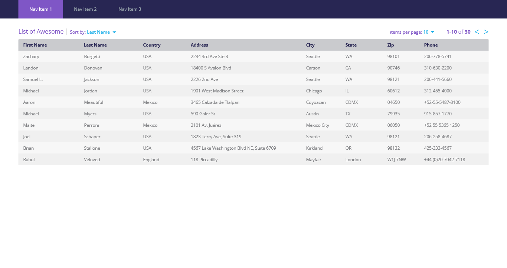

This is an exercise to exemplify ones coding skills, ability to follow instruction, creativity, attention to detail, and problem resolution.

##Exercise

**Given** a javascript array of 100,000 objects where each object is an address containing the following fields (assume that this array is returned by an ajax call):

* FirstName
* LastName
* Country
* Street
* City
* State
* Zip
* Phone

**Build** a single page and react JS component that implements an HTML/CSS table that displays the data as rows

Each row should be one object from the array and each column should be one element of the object. 

The table should have following controls:

* Page Size dropdown: This dropdown will let you select the page size and have values like (5 Items, 10 Items, 25 Items, 50 Items, 75 Items, and 100 Items).
* Next Button: The next button pages forward and loads the next set of rows
* Prev Button: The previous button page pages backward and loads the previous set of rows
* Count: The count should show the current indices and total number of items (eg: 11-20 of 100)
* Sorting: The rows should be sortable by clicking the column header

Please use the mock-up below for the details on layout, color, and size. Take time and consider all edge cases.

Attention to the details such as style and layout are important and the final result should be something you'd be proud to ship to customers. (aka. not a prototype.)

Extra points for demonstrating your creativity in both design and coding.

Ultimately check your code into a public Github repository for review.   

Important Note: Please do not use any opensource code (or ready made components available on the web). All code must be completely your own. You can use a font service for icons, for example FontAwesome. The component must be built from scratch using JS and React.

If you have any questions please do not hesitate to reach out.

Finally if you feel that this problem set and request is an unreasonable burden on your time, please consider the request withdrawn and accept our apologies. 

We look forward to checking out what you build!

See the Distelli_Candidate_UI_Test_Specs.pdf, in this repository, to view the specs.